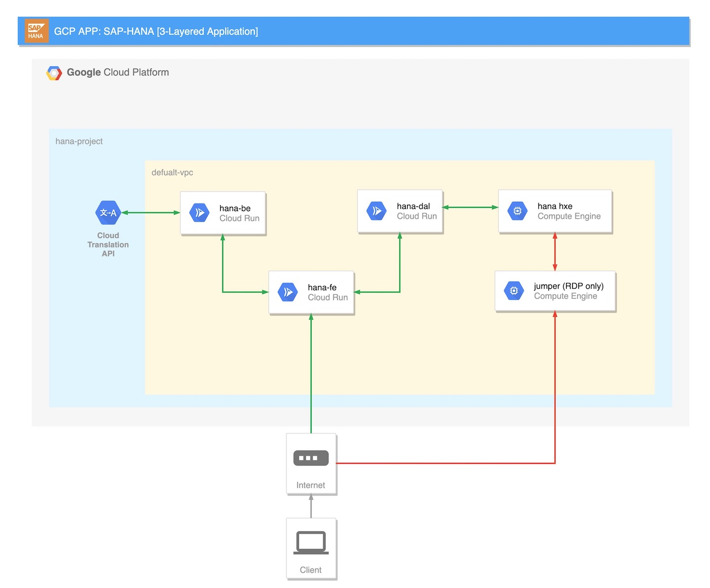

# Building-a-Cloud-App-for-SAP-HANA

## Table of Contents
* [Introduction](#introduction)
* [Usage](#usage)
* [Installation](#installation)
* [Usage](#usage)
* [License](#license)
* [Contributors](#contributors)
* [Questions](#questions)

## Introduction
SAP HANA is an in-memory database that is high perfomance and speeds up data driven actions and decisons. In this project I will deploy, a 3-layered interconnected GCloud application. A databse access layer that retrieves data from SAP HANA, a backend application that translates the records from the database using GCloud's Translation API, and a frontend application that triggers the translation and exposes the database records..

## Usage
 

## Installation

## Usage

## License

## Contributors

## Questions
Contact me:

Github: [https://github.com/mohmorsi](https://github.com/mohmorsi)

